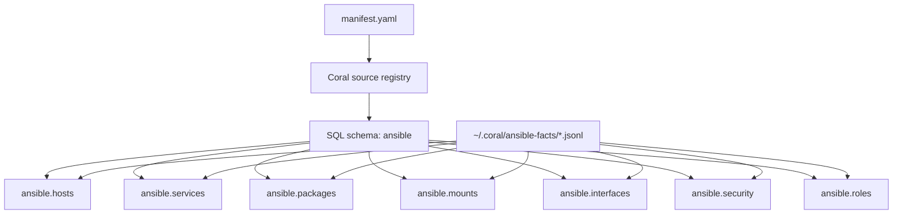
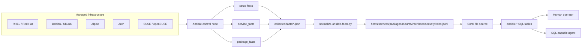
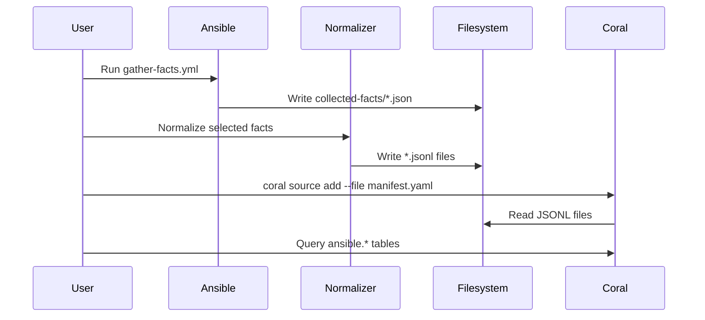

# ansible Coral Source

**Version:** `0.1.0`

**Backend:** `file`

**Tables:** `7`

**Default data directory:** `~/.coral/ansible-facts/`

Query sanitized, normalized Ansible fact exports with Coral SQL.

The `ansible` source exposes selected Ansible-derived infrastructure facts as SQL tables. It is designed for inventory lookup, service-state checks, package inspection, disk and mount analysis, network interface discovery, coarse security posture review, and role-drift detection.

This source is intentionally **file-backed** and **read-only**. Coral does not SSH into hosts, run Ansible playbooks, call AWX/Ansible Automation Platform, or mutate infrastructure. Users gather facts with Ansible first, normalize those facts into JSONL files, and then Coral reads those files as SQL tables.

The example playbook writes selected Ansible collection payloads to a restricted local directory before normalization. Treat those collected files as sensitive temporary input; only the normalized JSONL output is the allowlisted Coral source data.

## What this source provides

After installation, Coral exposes the source as the `ansible` SQL schema:

```text
ansible.hosts
ansible.services
ansible.packages
ansible.mounts
ansible.interfaces
ansible.security
ansible.roles
```

This allows queries like:

```sql
SELECT hostname, distribution, service_mgr, pkg_mgr
FROM ansible.hosts
ORDER BY hostname;
```

Example result:

```text
+--------------+--------------+-------------+---------+
| hostname     | distribution | service_mgr | pkg_mgr |
+--------------+--------------+-------------+---------+
| alpine-api   | Alpine       | openrc      | apk     |
| arch-observe | Archlinux    | systemd     | pacman  |
| debian-db    | Debian       | systemd     | apt     |
| rhel-control | RedHat       | systemd     | dnf     |
| suse-auth    | openSUSE     | systemd     | zypper  |
+--------------+--------------+-------------+---------+
```

This is useful because operational commands and troubleshooting paths differ by distribution, service manager, and package manager. A host using Alpine/OpenRC should not be treated the same as a RHEL/systemd host.

## How Coral uses this source

Coral reads `manifest.yaml`, registers the source as the `ansible` SQL schema, and maps each JSONL file to a SQL table.



The source spec defines:

* source name: `ansible`
* backend type: `file`
* table names
* JSONL file locations
* column names and types
* smoke-test queries

Coral then makes those tables available through normal SQL and through Coral catalog tables such as `coral.tables` and `coral.columns`.

## End-to-end architecture

This source sits between Ansible and Coral. Ansible is responsible for gathering facts. The normalizer is responsible for producing safe JSONL. Coral is responsible for making that JSONL queryable.



The important boundary is that Coral only sees normalized JSONL files. It does not receive broad raw Ansible output or credentials.

## Data flow



## Table overview

| Table                | Purpose                                                                                                 |
| -------------------- | ------------------------------------------------------------------------------------------------------- |
| `ansible.hosts`      | OS, distro, kernel, architecture, service manager, package manager, CPU, memory, Python, virtualization |
| `ansible.services`   | Service/unit state from normalized `service_facts`                                                      |
| `ansible.packages`   | Installed package versions from normalized `package_facts`                                              |
| `ansible.mounts`     | Filesystem mount size, availability, type, and options                                                  |
| `ansible.interfaces` | Network interface address, MTU, activity, and type                                                      |
| `ansible.security`   | Coarse posture fields such as SELinux/AppArmor/FIPS/firewall hint                                       |
| `ansible.roles`      | Optional curated mapping from host to intended role and expected service                                |

For the full table-design reasoning, see:

```text
docs/DESIGN.md
```

For the full list of example queries, see:

```text
queries/examples.sql
```

For review-focused test SQL that exercises JSON shape, service-name matching, security posture, and role drift, see:

```text
queries/review_tests.sql
```

For security boundaries, see:

```text
SECURITY_NOTES.md
```

## Data directory

The committed manifest expects JSONL files in:

```text
~/.coral/ansible-facts/
```

Expected files:

```text
hosts.jsonl
services.jsonl
packages.jsonl
mounts.jsonl
interfaces.jsonl
security.jsonl
roles.jsonl
```

The included fixture files are synthetic and can be used for a smoke test.

## Quick start with fixture data

From the Coral repo root:

```bash
mkdir -p ~/.coral/ansible-facts
cp sources/community/ansible/fixtures/*.jsonl ~/.coral/ansible-facts/
```

Lint and add the source:

```bash
coral source lint sources/community/ansible/manifest.yaml
coral source add --file sources/community/ansible/manifest.yaml
coral source test ansible
```

Expected result:

```text
ansible connected successfully
7 tables discovered
7 declared query tests passed
0 failed
```

Run a basic query:

```bash
coral sql "
  SELECT hostname, distribution, service_mgr, pkg_mgr
  FROM ansible.hosts
  ORDER BY hostname
"
```

## Windows local testing

The committed manifest uses a Unix-style path:

```yaml
location: file://~/.coral/ansible-facts/
```

On Windows, the same home-directory location is used by the Coral CLI:

```yaml
location: file://~/.coral/ansible-facts/
```

Example PowerShell workflow:

```powershell
$ansibleFacts = Join-Path $HOME ".coral\ansible-facts"
New-Item -ItemType Directory -Force $ansibleFacts
Copy-Item sources\community\ansible\fixtures\*.jsonl $ansibleFacts\ -Force

cargo run --locked -p coral-cli -- source lint sources/community/ansible/manifest.yaml
cargo run --locked -p coral-cli -- source add --file sources/community/ansible/manifest.yaml
cargo run --locked -p coral-cli -- source test ansible
```

The PowerShell workflow copies fixtures to the same home-relative path used by the committed manifest.

## Gathering facts from real hosts

Example inventory:

```ini
[linux]
rhel-control ansible_host=192.168.56.10
alpine-api ansible_host=192.168.56.11
arch-observe ansible_host=192.168.56.12
suse-auth ansible_host=192.168.56.13
debian-db ansible_host=192.168.56.14
```

Run the example gather and normalize flow:

```bash
mkdir -p collected-facts normalized-facts

ansible-playbook \
  -i examples/inventory.ini \
  examples/gather-facts.yml

python3 scripts/normalize-ansible-facts.py \
  --input collected-facts \
  --output normalized-facts

mkdir -p ~/.coral/ansible-facts
cp normalized-facts/*.jsonl ~/.coral/ansible-facts/
```

The example playbook disables automatic full fact gathering, gathers explicit `setup` subsets, and writes a selected collection payload containing only the fields consumed by the allowlist normalizer. Service, package, interface, and role/service metadata are narrowed before the temporary JSON file is written. The normalizer accepts that de-prefixed `ansible_facts` shape and the `ansible_*`-prefixed keys commonly seen in setup-style fact payloads.

The example does not use privilege escalation by default. If a target requires elevated privileges for selected setup, service, or package facts, opt in explicitly:

```bash
ansible-playbook \
  -i examples/inventory.ini \
  examples/gather-facts.yml \
  -e coral_ansible_become=true \
  --ask-become-pass
```

Only the remote fact-gathering tasks use `coral_ansible_become`; local file and template tasks on the control node stay unprivileged.

Then test:

```bash
coral source test ansible
```

Query:

```bash
coral sql "
  SELECT hostname, distribution, service_mgr, pkg_mgr
  FROM ansible.hosts
  ORDER BY hostname
"
```

## Typical use cases

### Fleet inventory

Answer questions such as:

```text
Which hosts are Alpine?
Which hosts use OpenRC?
Which hosts use zypper?
Which hosts are low-memory?
```

Example:

```sql
SELECT hostname, distribution, distribution_version, service_mgr, pkg_mgr
FROM ansible.hosts
ORDER BY distribution, hostname;
```

### Service triage

Answer questions such as:

```text
Which services are failed?
Which expected services are missing?
Which init system reported the service?
```

Example:

```sql
SELECT hostname, name, source, state, status
FROM ansible.services
WHERE LOWER(state) IN ('failed', 'stopped', 'unknown')
ORDER BY hostname, name;
```

### Package inspection

Answer questions such as:

```text
Which hosts have OpenSSL installed?
Which hosts are missing Podman?
Which package source reported this version?
```

Example:

```sql
SELECT hostname, source, name, version, arch
FROM ansible.packages
WHERE LOWER(name) IN ('openssl', 'python3', 'podman')
ORDER BY name, hostname;
```

### Disk and mount checks

Answer questions such as:

```text
Which mounts are almost full?
Which host has low available space?
Which filesystem type is used?
```

Example:

```sql
SELECT
  hostname,
  mount,
  fstype,
  size_available,
  size_total,
  ROUND((1.0 - CAST(size_available AS DOUBLE) / CAST(size_total AS DOUBLE)) * 100, 2) AS used_percent
FROM ansible.mounts
WHERE size_total > 0
ORDER BY used_percent DESC
LIMIT 20;
```

### Role drift checks

Answer questions such as:

```text
Which role expected a service that is missing?
Which host has a role-service mismatch?
```

Example:

```sql
SELECT
  r.hostname,
  r.role,
  r.expected_service,
  COALESCE(s.state, 'missing') AS observed_state,
  COALESCE(s.status, 'missing') AS observed_status
FROM ansible.roles r
LEFT JOIN ansible.services s
  ON s.hostname = r.hostname
 AND s.name = r.expected_service
WHERE r.expected_service IS NOT NULL
  AND (s.name IS NULL OR LOWER(s.state) NOT IN ('running', 'started'))
ORDER BY r.hostname, r.role;
```

## Coral catalog introspection

After adding the source, inspect its tables:

```sql
SELECT schema_name, table_name
FROM coral.tables
WHERE schema_name = 'ansible'
ORDER BY table_name;
```

Inspect columns:

```sql
SELECT table_name, column_name, data_type, is_nullable
FROM coral.columns
WHERE schema_name = 'ansible'
ORDER BY table_name, ordinal_position;
```

## Validation

From the Coral repo root:

```bash
python3 sources/community/ansible/tests/validate-fixtures.py sources/community/ansible/fixtures
make lint-sources
coral source lint sources/community/ansible/manifest.yaml
```

With fixture data copied into the configured directory:

```bash
coral source add --file sources/community/ansible/manifest.yaml
coral source test ansible
```

Expected result:

```text
ansible connected successfully
7 tables discovered
7 declared query tests passed
0 failed
```

## Troubleshooting

### `source.location must be a valid local file URL`

The path in `source.location` must match your operating system.

Linux/macOS:

```yaml
location: file://~/.coral/ansible-facts/
```

Windows:

```yaml
location: file://~/.coral/ansible-facts/
```

No OS-specific manifest copy is needed when the fixture data is copied to that home-relative directory.

### `Table ansible.hosts not found`

The source was not registered successfully.

Check:

```bash
coral source list
coral source test ansible
coral sql "SELECT DISTINCT schema_name FROM coral.tables"
```

Then re-add the source after fixing the data path.

### `Manifest is valid` but `source test` fails

`source lint` validates manifest structure. `source test` validates that the configured data path can actually be read and queried.

Check:

```bash
ls ~/.coral/ansible-facts
```

Windows:

```powershell
Get-ChildItem (Join-Path $HOME ".coral\ansible-facts")
```

### YAML syntax errors after PowerShell edits

Avoid:

```powershell
Set-Content manifest.yaml -NoNewline
```

That can collapse YAML into one line and break parsing.

## Limitations

* Snapshot-based, not live.
* File-backed, not API-backed.
* Does not run Ansible.
* Does not connect over SSH.
* Does not mutate infrastructure.
* Does not read Ansible Vault.
* Does not expose raw facts.
* Fact availability varies by OS, Python, privilege level, and installed packages.
* `service_facts` values vary by init system.
* `package_facts` may require OS-specific package manager support or Python libraries.
* Security data is deliberately coarse.

## Related files

```text
docs/DESIGN.md          deeper architecture, table design, snapshot behavior
SECURITY_NOTES.md       allowed fields, blocked fields, data handling rules
queries/examples.sql    basic, medium, and advanced SQL examples
manifest.yaml           Coral source spec
fixtures/               synthetic JSONL smoke-test data
examples/               Ansible inventory and fact-gathering example
scripts/                fact normalization script
tests/                  fixture validation script
```
