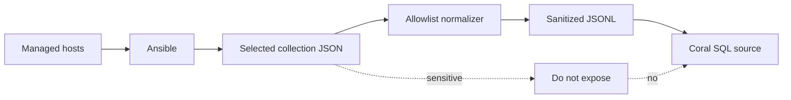

# Security Notes for the ansible Coral Source

This source is designed for **safe infrastructure inventory querying**, not for dumping raw Ansible state.

The core security rule is:

```text
Never expose raw ansible_facts wholesale to Coral.
Normalize and allowlist only useful operational columns.
```

Coral makes data easy to query. That is powerful, but it also means a bad export can make sensitive infrastructure data easy to access. The source should stay boring, conservative, and allowlisted.

## Security model

This source follows a conservative model:

1. Coral reads only sanitized JSONL files.
2. Coral does not SSH to hosts.
3. Coral does not run Ansible.
4. Coral does not use become/sudo.
5. Coral does not read Ansible Vault secrets.
6. Coral does not parse raw inventory variables.
7. Coral does not mutate infrastructure.
8. The normalizer decides what is safe to export.
9. Raw facts are not exposed as a table.
10. Fixtures are synthetic.

## Trust boundary



The important trust boundary is between:

```text
raw Ansible output
```

and:

```text
sanitized JSONL files
```

Only sanitized JSONL should reach Coral.

## Safe columns

Good examples:

```text
hostname
distribution
distribution_version
os_family
kernel
architecture
service manager
package manager
service name
service source
service state
service status
package name
package version
package source
mount path
filesystem type
available bytes
total bytes
interface name
coarse IPv4 metadata
MTU
SELinux status
SELinux mode
AppArmor status
FIPS boolean
curated role name
expected service name
```

These fields are useful for operational queries and usually do not expose secret values by themselves.

## Unsafe fields to avoid

Do not export:

```text
Ansible Vault values
passwords
API tokens
private keys
SSH private keys
SSH public key values if not needed
cloud metadata credentials
environment variables
raw ansible_env
raw command-line arguments
full process lists
user shell history
full user/group databases
raw inventory variables
raw group_vars
raw host_vars
arbitrary ansible_local payloads
raw firewall rules
full SELinux policy dumps
full AppArmor profiles
full config files
raw task output
raw callback output
```

If a field could contain a secret, user identity detail, internal network policy, or customer-specific information, exclude it by default.

## Why raw facts are risky

Raw Ansible facts can contain more than expected:

* host identity information
* environment data
* local facts
* network details
* interface details
* virtualization details
* custom facts
* module-specific values
* organization-specific naming
* potentially sensitive metadata

Even when a field is not a password, it may still reveal internal topology or infrastructure policy. This source should expose stable operational columns, not a full host dump.

## Normalizer requirements

The normalizer should be allowlist-based.

Good:

```python
row = {
    "hostname": hostname,
    "distribution": facts.get("distribution"),
    "service_mgr": facts.get("service_mgr"),
    "pkg_mgr": facts.get("pkg_mgr"),
}
```

Bad:

```python
row = facts
```

Do not add a column like:

```text
raw_facts
raw_payload
raw_json
ansible_local
```

Those defeat the purpose of the security model.

## Recommended Ansible practices

When gathering facts for this source:

* use least-privilege Ansible credentials
* leave privilege escalation disabled unless a target requires it for selected fact modules
* avoid gathering unnecessary fact subsets in sensitive environments
* use `no_log: true` on tasks that may touch secrets
* keep Vault-encrypted files out of the export path
* do not print secrets in debug tasks
* write selected collection payloads to a restricted directory
* normalize into a separate output directory
* review generated JSONL before publishing it to Coral
* delete selected collection payloads and any broader raw facts if they are no longer needed
* do not commit generated facts from real systems
* use synthetic fixtures in the repository
* keep selected service, package, and interface payloads limited to fields normalized into Coral tables
* keep role metadata limited to role, environment, source file, and expected service fields

## Fact gathering scope

The example playbook disables automatic full fact gathering and uses explicit `setup` subsets plus module calls to gather a selected collection payload for:

```text
distribution
os_family
kernel
pkg_mgr
service_mgr
mounts
network metadata
virtualization
python
service_facts
package_facts
```

Privilege escalation is opt-in through `coral_ansible_become=true` and applies only to remote fact-gathering tasks. Local writes on the control node remain unprivileged.

Do not gather or export high-risk data unless there is a clear documented need.

## Handling Ansible Vault

Ansible Vault protects sensitive data at rest, but decrypted values can still leak if tasks print them or if raw variables are exported.

Rules:

* do not export Vault variables
* do not normalize decrypted secret values
* do not include Vault files in fixtures
* do not include Vault IDs or secret names unless intentionally safe
* do not use this source as a secret inventory

## Handling `ansible_local`

`ansible_local` can contain arbitrary custom facts. That makes it risky.

Default rule:

```text
Do not export ansible_local.
```

If a future version needs local facts, add a dedicated curated table with explicit allowlisted keys.

## Security posture table rules

The `ansible.security` table should expose only coarse posture.

Allowed:

```text
selinux_status
selinux_mode
selinux_policy
apparmor_status
fips
firewall_hint
ssh_host_keys_collected boolean
```

Not allowed:

```text
SSH key values
full firewall rules
SELinux policy bodies
AppArmor profile contents
user lists
secret-bearing config files
```

The goal is to answer:

```text
Is SELinux enforcing?
Is AppArmor present?
Is FIPS reported?
Is there a coarse firewall hint?
```

not:

```text
What are all policies and rules on this host?
```

## Filesystem security

Recommended local permissions:

```bash
mkdir -p /var/lib/coral/ansible/current
chmod 0750 /var/lib/coral/ansible
chmod 0640 /var/lib/coral/ansible/current/*.jsonl
```

Keep selected collection payloads at least as restricted as normalized facts:

```bash
chmod 0700 collected-facts
chmod 0750 normalized-facts
```

If snapshots are used for audit/compliance, store them in a durable restricted path, not `/tmp`.

## Git safety

Never commit generated facts from real hosts.

Recommended `.gitignore` entries for local testing:

```gitignore
collected-facts/
raw-facts/
normalized-facts/
*.retry
manifest.windows.local.yaml
```

The repository should contain only:

```text
synthetic fixtures
safe examples
normalizer code
manifest
docs
queries
tests
```

## Review checklist

Before opening a PR, verify:

```text
No real hostnames
No real private IPs from an actual company network
No passwords
No tokens
No private keys
No Vault values
No raw inventory variables
No raw group_vars or host_vars
No environment variables
No raw ansible_local payloads
No generated production facts
No Windows-only local manifest committed
No target/ or node_modules/ committed
```

Commands:

```bash
git status
git diff --check
python3 sources/community/ansible/tests/validate-fixtures.py sources/community/ansible/fixtures
make lint-sources
coral source lint sources/community/ansible/manifest.yaml
```

## What to do if sensitive data is accidentally exported

1. Stop using the generated JSONL snapshot.
2. Delete the affected normalized files.
3. Delete or restrict selected collection files and any broader raw fact files.
4. Rotate exposed credentials if any secrets were present.
5. Remove the data from Git history if it was committed.
6. Add a normalizer rule to prevent the field from being exported again.
7. Add a fixture/test case to catch the class of leak.
8. Regenerate a clean snapshot.

## Security principle

This source should answer operational questions like:

```text
What OS is this host?
What package manager should I use?
Is this service running?
Is disk space low?
Is SELinux enforcing?
```

It should not answer sensitive questions like:

```text
What secrets exist on this host?
What environment variables are set?
What users exist?
What keys are present?
What are the exact firewall rules?
What are the raw inventory variables?
```

Keep the source safe, narrow, and boring.
