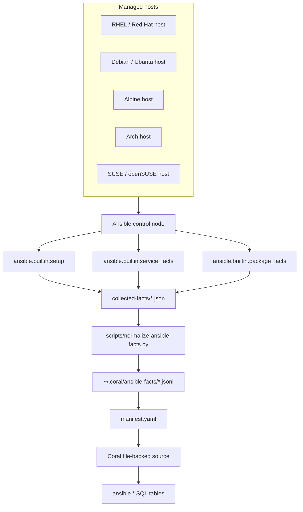
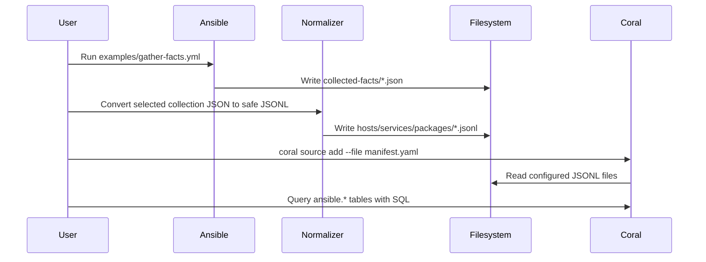

# Design Notes

## Goal

Expose selected, normalized Ansible facts to Coral SQL as a **file-backed, read-only community source**.

The source name is:

```text
ansible
```

The SQL schema exposed by Coral is:

```sql
ansible.*
```

The source turns sanitized JSONL files into queryable SQL tables:

```text
ansible.hosts
ansible.services
ansible.packages
ansible.mounts
ansible.interfaces
ansible.security
ansible.roles
```

This lets users query infrastructure facts with SQL without giving Coral SSH credentials, Ansible Vault secrets, private keys, raw inventory variables, or direct access to managed hosts.

## Non-goals

This first source intentionally does **not**:

* execute Ansible from Coral
* connect over SSH
* use `become` or privilege escalation
* run playbooks
* mutate infrastructure
* call AWX or Ansible Automation Platform APIs
* expose raw `ansible_facts`
* expose raw inventory, `group_vars`, or `host_vars`
* store credentials or secrets in Coral
* model every possible Ansible module output
* replace Ansible, AWX, AAP, CMDBs, or monitoring systems

Those are separate source designs and should not be mixed into this initial source.

## Why this source is useful

Ansible already discovers a large amount of infrastructure state:

* operating system
* distribution
* kernel
* service manager
* package manager
* mount points
* network interfaces
* virtualization details
* service states
* installed packages
* selected security posture facts

Coral makes this infrastructure knowledge queryable through SQL.

For example, a user can ask:

```sql
SELECT hostname, distribution, service_mgr, pkg_mgr
FROM ansible.hosts
ORDER BY hostname;
```

This matters because operational commands differ across Linux families:

| Distribution family    | Common service manager | Common package manager |
| ---------------------- | ---------------------- | ---------------------- |
| RHEL / Fedora / CentOS | `systemd`              | `dnf`, `yum`, `rpm`    |
| Debian / Ubuntu        | `systemd`              | `apt`, `dpkg`          |
| Alpine                 | `openrc`               | `apk`                  |
| Arch                   | `systemd`              | `pacman`               |
| SUSE / openSUSE        | `systemd`              | `zypper`, `rpm`        |

A safe troubleshooting system should not blindly suggest `systemctl` or `apt` for every host. The correct command depends on the host facts.

## High-level architecture



## Data flow



## Responsibility boundaries

| Layer             | Responsibility                             | Should not do                  |
| ----------------- | ------------------------------------------ | ------------------------------ |
| Ansible           | Connect to hosts and gather facts          | Store normalized Coral schema  |
| Normalizer        | Allowlist and flatten safe fields          | Dump all raw facts             |
| JSONL directory   | Hold the current query snapshot            | Act as a secret store          |
| Coral source spec | Declare tables, columns, file paths, tests | Execute Ansible                |
| Coral SQL         | Query normalized fact tables               | Mutate infrastructure          |
| User / agent      | Interpret evidence and decide actions      | Assume facts are live if stale |

## Why file-backed?

This source is file-backed because Ansible fact data is naturally generated as local output.

A file-backed source is safer and easier to review than a live connector because it avoids:

* SSH handling inside Coral
* sudo/become handling inside Coral
* Vault secret handling inside Coral
* inventory secret parsing
* API authentication
* remote command execution
* mutation risk

The tradeoff is freshness. A file-backed source represents a **snapshot** of facts, not a live continuous stream.

## Data generation model

Recommended flow:

```text
1. Gather facts from hosts.
2. Write selected collection JSON to collected-facts/.
3. Normalize selected collection JSON into JSONL.
4. Validate JSONL.
5. Copy JSONL into the configured Coral data directory.
6. Run coral source test ansible.
7. Query ansible.* tables.
```

Example:

```bash
mkdir -p collected-facts normalized-facts

ansible-playbook \
  -i examples/inventory.ini \
  examples/gather-facts.yml

python3 scripts/normalize-ansible-facts.py \
  --input collected-facts \
  --output normalized-facts

mkdir -p ~/.coral/ansible-facts
cp normalized-facts/*.jsonl ~/.coral/ansible-facts/

coral source test ansible
```

The example gather playbook does not enable `become` by default. Users can opt in for the remote setup, service, and package fact tasks with `coral_ansible_become=true` when their targets require elevated fact collection. Control-node file writes remain unprivileged.

## Table design principles

1. **Use one entity per row.**
   One host, package, service, mount, interface, security posture record, or role mapping per row.

2. **Flatten nested facts where possible.**
   Useful SQL should not require deep JSON traversal for common questions.

3. **Use JSON only for safe arrays.**
   Example: `ipv6_addresses` can be a JSON array. Raw fact blobs should not be stored.

4. **Avoid raw payload columns.**
   Do not add columns like `raw_facts`, `raw_service`, `raw_package`, or `ansible_local`.

5. **Keep table names obvious.**
   Use `hosts`, `services`, `packages`, `mounts`, `interfaces`, `security`, and `roles`.

6. **Favor stable operational meaning.**
   The source should answer operational questions, not mirror every Ansible internal structure.

7. **Keep sensitive details out.**
   A useful source is not the same as a complete raw dump.

## Tables

### `ansible.hosts`

Purpose: host identity and OS facts.

Examples of questions it answers:

```text
Which hosts are Alpine?
Which hosts use OpenRC?
Which hosts use apt vs dnf vs apk?
Which hosts have low memory?
Which hosts are virtualized?
Which Python interpreter did Ansible use?
```

Typical query:

```sql
SELECT hostname, distribution, distribution_version, service_mgr, pkg_mgr
FROM ansible.hosts
ORDER BY hostname;
```

### `ansible.services`

Purpose: service state inventory from normalized `service_facts`.

Examples of questions it answers:

```text
Which services are failed?
Which hosts have stopped services?
Which init system reported this service?
Is the expected service running?
```

Typical query:

```sql
SELECT hostname, name, source, state, status
FROM ansible.services
WHERE LOWER(state) IN ('failed', 'stopped', 'unknown')
ORDER BY hostname, name;
```

### `ansible.packages`

Purpose: installed package inventory from normalized `package_facts`.

Examples of questions it answers:

```text
Is openssl installed?
Which hosts have podman?
Which Python package version is installed?
Which package manager reported the package?
```

Typical query:

```sql
SELECT hostname, name, version, release, arch, source
FROM ansible.packages
WHERE LOWER(name) IN ('openssl', 'python3', 'podman')
ORDER BY name, hostname;
```

### `ansible.mounts`

Purpose: filesystem mount and capacity facts.

Examples of questions it answers:

```text
Which mounts are low on free space?
Which database host has disk pressure?
Which filesystems are mounted read-only?
```

Typical query:

```sql
SELECT
  hostname,
  mount,
  fstype,
  size_available,
  size_total,
  ROUND((1.0 - CAST(size_available AS DOUBLE) / CAST(size_total AS DOUBLE)) * 100, 2) AS used_percent
FROM ansible.mounts
WHERE size_total > 0
ORDER BY used_percent DESC;
```

### `ansible.interfaces`

Purpose: selected network interface metadata.

Examples of questions it answers:

```text
Which interfaces are active?
What IPv4 address was discovered?
Is there an MTU mismatch?
```

Typical query:

```sql
SELECT hostname, interface, ipv4_address, mtu, active
FROM ansible.interfaces
WHERE active = true
ORDER BY hostname, interface;
```

### `ansible.security`

Purpose: coarse security posture only.

Examples of questions it answers:

```text
Is SELinux enforcing?
Is AppArmor reported?
Is FIPS enabled?
Is there a coarse firewall hint?
```

Typical query:

```sql
SELECT hostname, selinux_status, selinux_mode, apparmor_status, fips, firewall_hint
FROM ansible.security
ORDER BY hostname;
```

This table must not contain raw policy dumps, keys, tokens, users, or firewall rule bodies.

### `ansible.roles`

Purpose: curated intended role mapping.

This table is optional and should be created from a safe curated mapping, not raw inventory variable dumps.

Examples of questions it answers:

```text
Which role is expected on this host?
Which service should exist because of this role?
Is the expected service missing or stopped?
```

Typical query:

```sql
SELECT
  r.hostname,
  r.role,
  r.expected_service,
  COALESCE(s.state, 'missing') AS observed_state
FROM ansible.roles r
LEFT JOIN ansible.services s
  ON s.hostname = r.hostname
 AND s.name = r.expected_service
WHERE r.expected_service IS NOT NULL
ORDER BY r.hostname, r.role;
```

## Why `roles` is curated

Ansible roles can contain:

* tasks
* handlers
* templates
* files
* defaults
* vars
* metadata

Role variables may contain sensitive values or internal policy. Therefore, `ansible.roles` is **not** raw role parsing.

It is only a curated table such as:

```json
{"hostname":"debian-db","role":"database","environment":"homelab","source_file":"inventory/host_roles.yml","expected_service":"postgresql.service"}
```

Good:

```text
host -> intended role -> expected service
```

Bad:

```text
raw role vars
raw defaults
raw templates
raw task args
secrets from group_vars
```

## Snapshot and ACID-like behavior

This source is not a transactional database. It is a read-only file-backed SQL source over JSONL snapshots.

Full ACID semantics do not apply to data generation because Coral is not performing writes to the dataset. However, users should apply ACID-inspired operational discipline when refreshing fact snapshots.

### Atomicity

Do not overwrite live JSONL files while Coral may be querying them.

Bad:

```text
the live source.location directory is overwritten in place
```

Better:

```text
1. write new files into a staging directory
2. validate staging files
3. promote the whole snapshot
```

Recommended Linux layout:

```text
/var/lib/coral/ansible/
├── snapshots/
│   ├── 2026-05-29T120000Z/
│   └── 2026-05-29T130000Z/
└── current -> snapshots/2026-05-29T130000Z
```

Then configure:

```yaml
location: file:///var/lib/coral/ansible/current/
```

### Consistency

Every snapshot should be internally consistent.

A good snapshot has:

* all expected JSONL files present
* valid JSONL syntax
* required columns populated
* consistent hostnames across tables
* no accidental duplicate rows
* query tests passing
* schema matching `manifest.yaml`

Validation:

```bash
python3 tests/validate-fixtures.py /path/to/snapshot
coral source test ansible
```

### Isolation

Avoid queries reading half-written files.

Use a staging directory and promote only after all files are complete.

Bad:

```text
normalizer writes directly into the live source.location directory
```

Good:

```text
normalizer writes to staging, then a completed snapshot is promoted
```

### Durability

Durability is provided by the filesystem and backup policy.

Recommended:

* keep timestamped snapshots
* retain at least one last-known-good snapshot
* store production snapshots outside `/tmp`
* back up snapshots if they are used for audits
* record gather time and inventory version in external metadata or future tables

## Freshness model

This source is snapshot-based.

That means:

```text
SQL query time != host fact gathering time
```

Users should not assume that `ansible.hosts` is live. The data is only as fresh as the last gather-and-normalize run.

Recommended future metadata table:

```text
ansible.snapshot_metadata
```

Possible columns:

```text
snapshot_id
generated_at
inventory_name
ansible_version
normalizer_version
host_count
```

This is a good future extension, but not required for the first source.

## Query design goals

Queries should make common operational checks simple:

```text
host inventory
service failures
package presence
disk pressure
security posture
role drift
cross-distro command selection
```

Examples are kept in:

```text
queries/examples.sql
```

## Future extensions

Good future additions:

* `ansible.snapshot_metadata`
* `ansible.inventory_groups`
* `ansible.collections`
* `ansible.playbook_runs` from sanitized callback output
* `ansible.task_results` from sanitized callback output
* `ansible.files` from curated `stat` output
* `ansible.firewalld` from sanitized firewall facts

Keep these separate from the initial source unless the data model is safe and clearly documented.

## Separate-source candidates

These should not be mixed into this `ansible` source:

* Podman containers
* OpenShift APIs
* OpenStack APIs
* AWX / Ansible Automation Platform APIs
* live SSH command execution
* vulnerability scanner output
* monitoring telemetry

Those should be separate Coral sources because they have different auth, data models, and operational risk.
