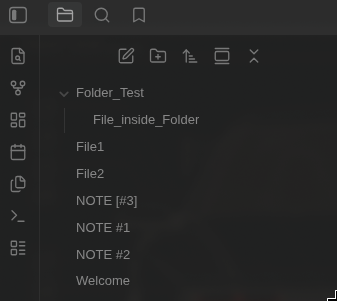
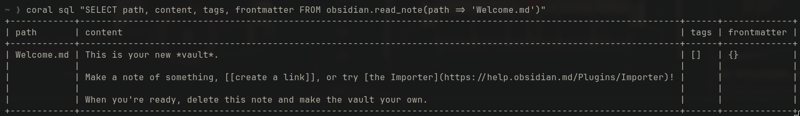
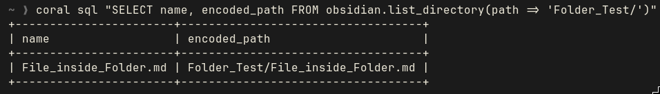
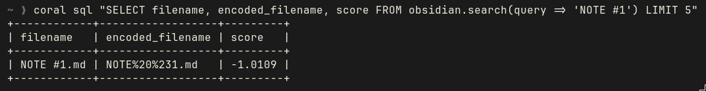
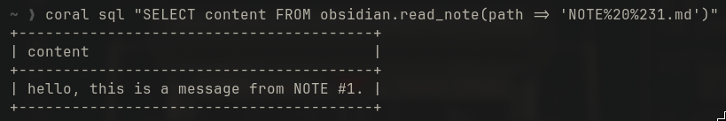
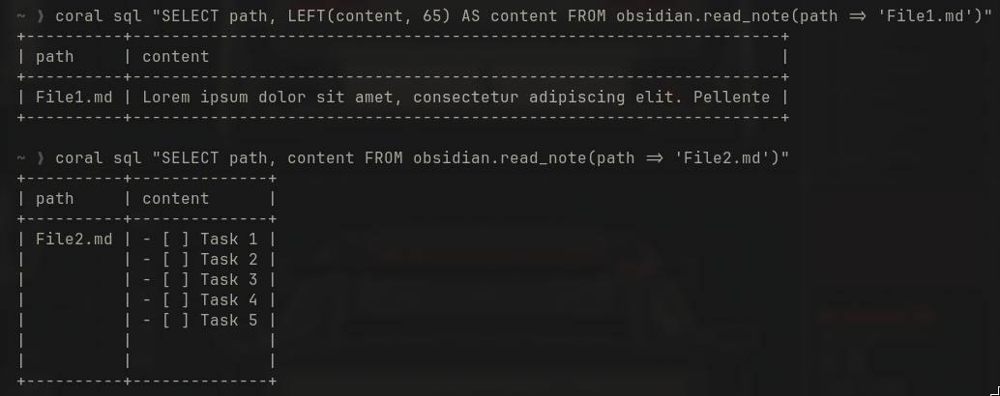
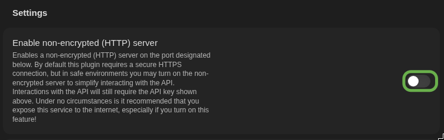
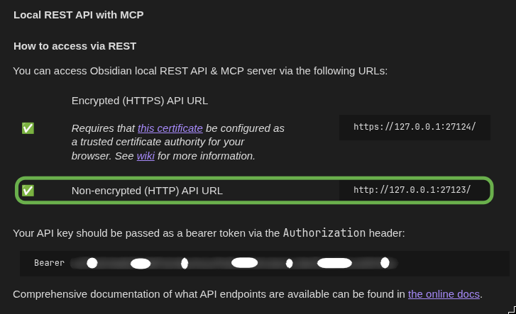
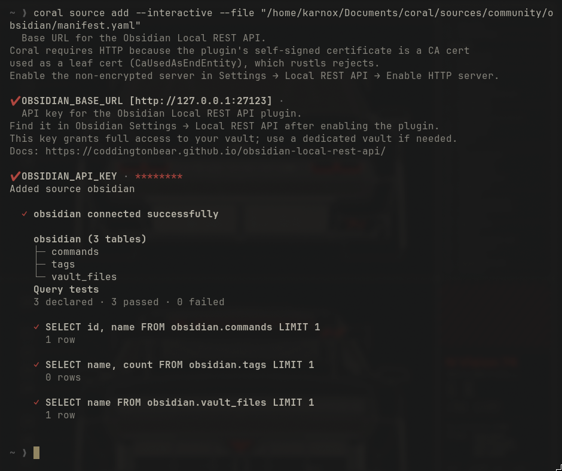
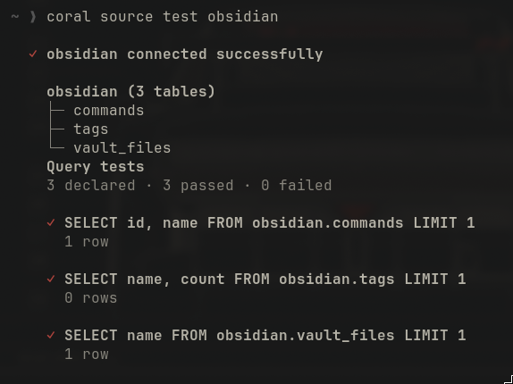

# Obsidian Local REST API (obsidian)

**Version:** 0.2.0
**Backend:** HTTP
**Tables:** 3
**Functions:** 3
**Base URL:** `http://127.0.0.1:27123`

Query notes, commands, tags, and search results from your Obsidian vault via the [Local REST API](https://github.com/coddingtonbear/obsidian-local-rest-api) plugin.

```bash
coral source add --interactive --file sources/community/obsidian/manifest.yaml
```

## Requirements

- Obsidian with the [Local REST API](https://github.com/coddingtonbear/obsidian-local-rest-api) plugin installed and enabled
- The plugin's API key (found in Settings → Local REST API)

## Tables

| Table | Description |
|-------|-------------|
| `commands` | Available Obsidian command palette actions |
| `tags` | Tags across the vault with usage counts |
| `vault_files` | Files and folders at the vault root |

## Functions

| Function | Description |
|----------|-------------|
| `search(query)` | Fuzzy search notes by keyword (returns ranked results with scores) |
| `read_note(path)` | Read a note as structured JSON with content, tags, and frontmatter. Use a percent-encoded vault path. |
| `list_directory(path)` | List files and folders in a vault directory. Use a percent-encoded directory path ending in `/`. |

## Example Queries

### List available commands

```sql
SELECT id, name FROM obsidian.commands LIMIT 20
```

### List all tags with usage counts

```sql
SELECT name, count FROM obsidian.tags ORDER BY count DESC
```

### Search notes

```sql
SELECT filename, score FROM obsidian.search(query => 'File_name') LIMIT 10
```

### List files at vault root

```sql
SELECT name, encoded_name FROM obsidian.vault_files
```

### List files in a subdirectory

```sql
SELECT name, encoded_path FROM obsidian.list_directory(path => 'Folder/')
```

### Read a note by path

```sql
SELECT content FROM obsidian.read_note(path => 'path/to/file.md')
```

For paths containing reserved URL characters, pass the encoded value returned
by `vault_files`, `search`, or `list_directory`:

```sql
SELECT filename, encoded_filename
FROM obsidian.search(query => 'NOTE #1')
LIMIT 10
```

```sql
SELECT content
FROM obsidian.read_note(path => 'NOTE%20%231.md')
```

### Read note metadata

```sql
SELECT path, encoded_path, tags, frontmatter FROM obsidian.read_note(path => 'file.md')
```

## Quick start

```bash
# Confirm connectivity
coral sql "SELECT id, name FROM obsidian.commands LIMIT 1"

# List files at vault root
coral sql "SELECT name, encoded_name FROM obsidian.vault_files"

# Read a note by path
coral sql "SELECT path, content FROM obsidian.read_note(path => 'Welcome.md')"
```

## Live Test

### Source connectivity

```
$ coral source test obsidian

  ✓ obsidian connected successfully

    obsidian (3 tables)
    ├─ commands
    ├─ tags
    └─ vault_files
    Query tests
    3 declared · 3 passed · 0 failed
```

### Sample queries and output

```sql
SELECT id, name FROM obsidian.commands LIMIT 5
```

| id | name |
|----|------|
| editor:save-file | Save current file |
| editor:download-attachments | Download attachments for current file |
| editor:follow-link | Follow link under cursor |
| editor:open-link-in-new-leaf | Open link under cursor in new tab |
| editor:open-link-in-new-window | Open link under cursor in new window |

```sql
SELECT name, encoded_name FROM obsidian.vault_files
```

| name | encoded_name |
|------|--------------|
| File1.md | File1.md |
| File2.md | File2.md |
| Folder_Test/ | Folder_Test/ |
| NOTE #1.md | NOTE%20%231.md |
| NOTE #2.md | NOTE%20%232.md |
| NOTE [#3].md | NOTE%20%5B%233%5D.md |
| Welcome.md | Welcome.md |



```sql
SELECT path, content, tags, frontmatter FROM obsidian.read_note(path => 'Welcome.md')
```

| path | content | tags | frontmatter |
|------|---------|------|-------------|
| Welcome.md | This is your new *vault*. Make a note of something... | [] | {} |



```sql
SELECT name, encoded_path FROM obsidian.list_directory(path => 'Folder_Test/')
```

| name | encoded_path |
|------|--------------|
| File_inside_Folder.md | Folder_Test/File_inside_Folder.md |



```sql
SELECT filename, encoded_filename, score FROM obsidian.search(query => 'NOTE #1') LIMIT 5
```

| filename | encoded_filename | score |
|----------|------------------|-------|
| NOTE #1.md | NOTE%20%231.md | -1.0109 |



```sql
SELECT content FROM obsidian.read_note(path => 'NOTE%20%231.md')
```



Some more Live Test:



## Setup

The plugin must be installed and enabled in Obsidian. Coral requires the **HTTP** endpoint
because the plugin's self-signed certificate is a CA cert used as a leaf cert, which
rustls rejects.

1. Open **Settings → Local REST API** in Obsidian.
2. Scroll down and Enable **Non-encrypted (HTTP) server**.



3. Confirm the HTTP URL is `http://127.0.0.1:27123`.



```bash
# Verify HTTP works
curl http://127.0.0.1:27123/
```

4. Then add the source via `coral source add --interactive --file sources/community/obsidian/manifest.yaml`.
Note: paste the token without the Bearer text the process automatically adds the text.



5. Test the source using `coral source test obsidian`.



## Notes

- The API key grants full access to your vault. Use a dedicated vault if needed.
- See the [API documentation](https://coddingtonbear.github.io/obsidian-local-rest-api/) for full details.
